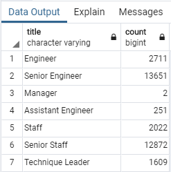
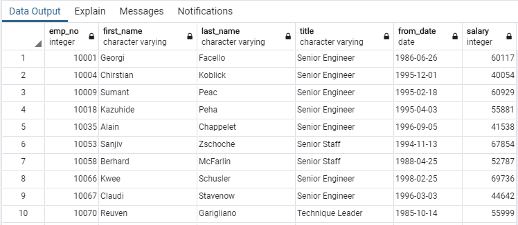
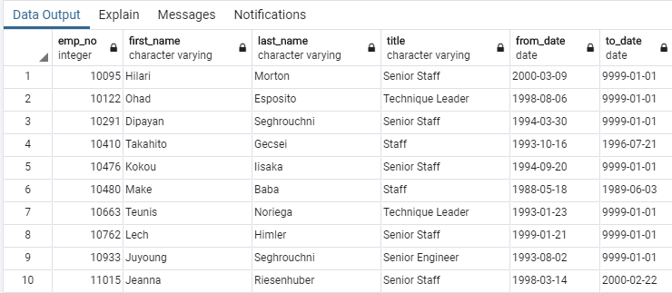

# Pewlett-Hackard-Analysis

## Technical Analysis Deliverable 1: Number of Retiring Employees by Title. 

### Number of [titles] retiring
Table: retiree_titles|   CSV: retiree_titles.csv

### Number of employees with each title
Table: retirement_eligible   |   CSV: retirement_eligible.csv

### List of current employees born between Jan. 1, 1952 and Dec. 31, 1955
Table: empFrom_retirement_years   |   CSV: empFrom_retirement_years.csv

## Technical Analysis Deliverable 2: Mentorship Eligibility. 
A table containing employees who are eligible for the mentorship program You will submit your table and the CSV containing the data (and the CSV containing the data)

Table: mentorship_eligible   |   CSV: mentorship_eligible.csv

## Technical Report

In your first paragraph, introduce the problem that you were using data to solve.

In your second paragraph, summarize the steps that you took to solve the problem, as well as the challenges that you encountered along the way. This is an excellent spot to provide examples and descriptions of the code that you used.

In your final paragraph, share the results of your analysis and discuss the data that you’ve generated. Have you identified any limitations to the analysis? What next steps would you recommend?

Be sure to include an image of the ERD you created when mapping out the database in your README.md.

Remember that the ability to discuss your work effectively is what will set you apart as a data professional.
