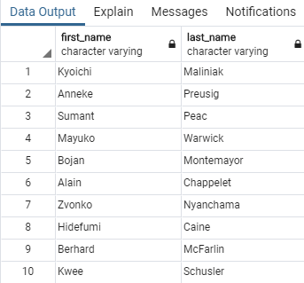
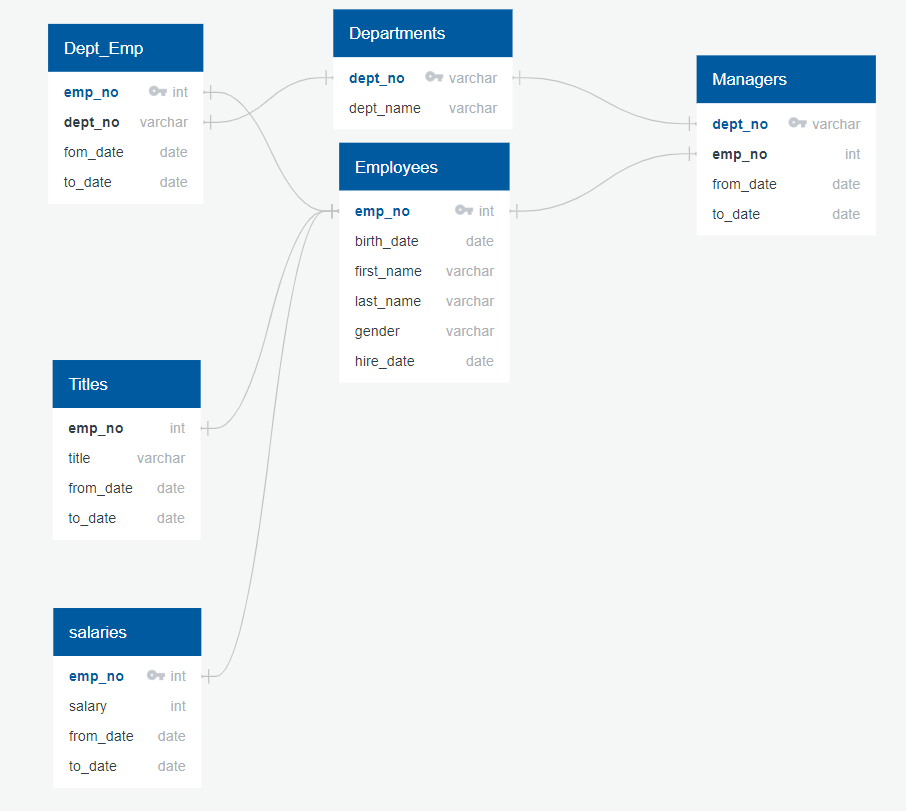

# Pewlett-Hackard-Analysis

### Technical Report

Pewlett-Hackard is a large organization that has been in existing for a long time. They are currently anticipating a large number of retirements in-part because many of their employees are “baby-boomers”. An employee analysis is needed as packages will be offered to eligible staff. Secondly insight is needed into which positions and titles will be vacated so they can prepare to refill them. The specify questions driving the analysis are: Who will retire and how many positions will need to be filled.

My approach to the analysis was to first get a raw list of employees that are retirement eligible. From this list a series of joins and further manipulation was performed to glean insight from the data. 
For example using “count()” & “group by” to generate the number of titles eligible to retire reveals that most of the eligible positions are senior ones (80% are Senior Engineers & Senior Staff).

The queries to determine mentorship eligibility reveal that a relatively small number of staff qualifies when compared to the number of retirees. 1,940 compared to 33,118 potential retirees.

One challenge faced when building the ERD was determining which data sources did not need a primary key, for example the titles data set. Another challenge that arose was understanding how to remove the duplicate titles from tables since some employees have had multiple through their career.

The largest limitation with the analysis is that it doesn't take into account employee desires. Just because an employee is eligible to retire does not mean they wish to. The same logic applies to the mentorship program, all eligible may not participate.
Further research should be done on the staff that do not fit either retirement or mentorship criteria. This is a large group and will need attention for the company to succeed. 

=====================================================================================================

### Technical Analysis Deliverable 1: Number of Retiring Employees by Title. 

#### Number of [titles] retiring
Table: retiree_titles   |   CSV: retiree_titles.csv

#### Number of employees with each title
Table: retirement_eligible   |   CSV: retirement_eligible.csv

#### List of current employees born between Jan. 1, 1952 and Dec. 31, 1955
Table: empFrom_retirement_years   |   CSV: empFrom_retirement_years.csv

### Technical Analysis Deliverable 2: Mentorship Eligibility. 
A table containing employees who are eligible for the mentorship program

Table: mentorship_eligible   |   CSV: mentorship_eligible.csv

Entity Relationship Diagram (ERD)

